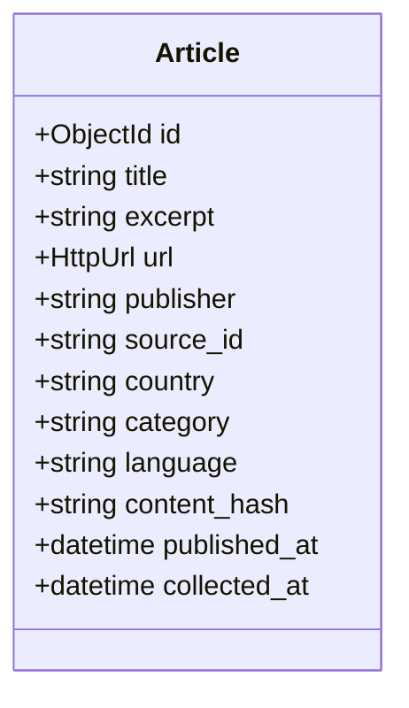

# Article Model Class Diagram

```mermaid
classDiagram
    direction TB

    class Article {
        +ObjectId id
        +string title
        +string excerpt
        +HttpUrl url
        +string publisher
        +string source_id
        +string country
        +string category
        +string language
        +string content_hash
        +datetime published_at
        +datetime collected_at
    }
```

