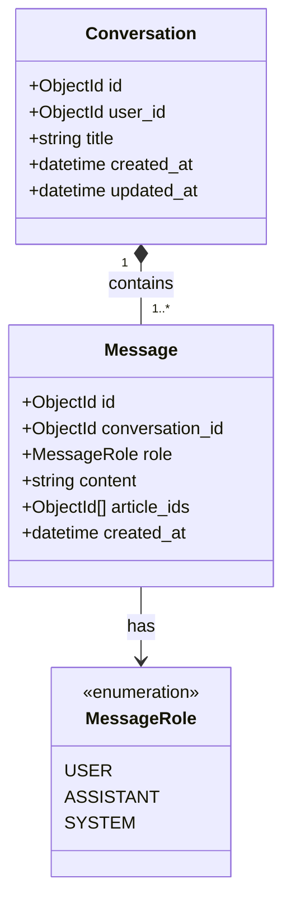

# Conversation Model Class Diagram

```mermaid
classDiagram
    direction TB

    class Conversation {
        +ObjectId id
        +ObjectId user_id
        +string title
        +datetime created_at
        +datetime updated_at
    }

    class Message {
        +ObjectId id
        +ObjectId conversation_id
        +MessageRole role
        +string content
        +ObjectId[] article_ids
        +datetime created_at
    }

    class MessageRole {
        <<enumeration>>
        USER
        ASSISTANT
        SYSTEM
    }

    Conversation "1" *-- "1..*" Message : contains
    Message --> MessageRole : has
```
