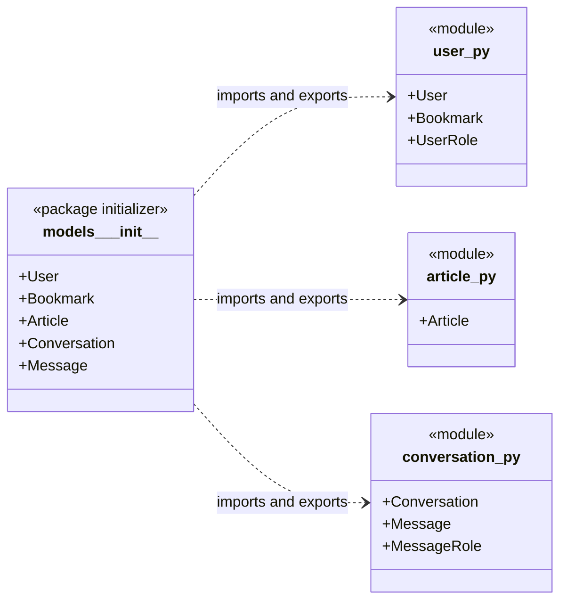

# Models Package Initializer Diagram

`__init__.py` is a package initializer rather than a domain model. Its responsibility is to re-export the model classes defined by the other modules.

```mermaid
classDiagram
    direction LR

    class models___init__ {
        <<package initializer>>
        +User
        +Bookmark
        +Article
        +Conversation
        +Message
    }

    class user_py {
        <<module>>
        +User
        +Bookmark
        +UserRole
    }

    class article_py {
        <<module>>
        +Article
    }

    class conversation_py {
        <<module>>
        +Conversation
        +Message
        +MessageRole
    }

    models___init__ ..> user_py : imports and exports
    models___init__ ..> article_py : imports and exports
    models___init__ ..> conversation_py : imports and exports
```
