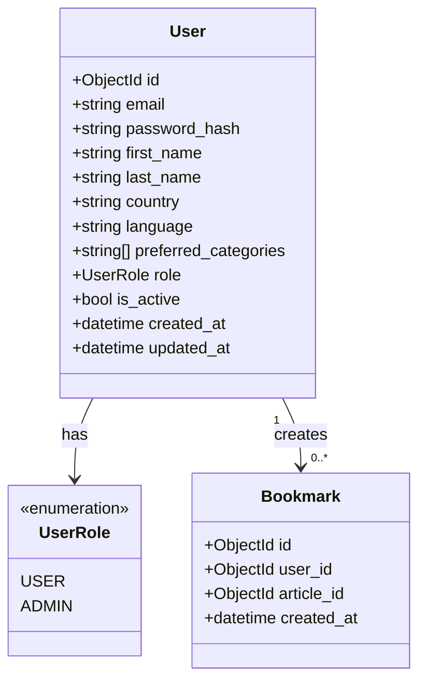

# User Model Class Diagram

```mermaid
classDiagram
    direction TB

    class User {
        +ObjectId id
        +string email
        +string password_hash
        +string first_name
        +string last_name
        +string country
        +string language
        +string[] preferred_categories
        +UserRole role
        +bool is_active
        +datetime created_at
        +datetime updated_at
    }

    class UserRole {
        <<enumeration>>
        USER
        ADMIN
    }

    class Bookmark {
        +ObjectId id
        +ObjectId user_id
        +ObjectId article_id
        +datetime created_at
    }

    User --> UserRole : has
    User "1" --> "0..*" Bookmark : creates
```

